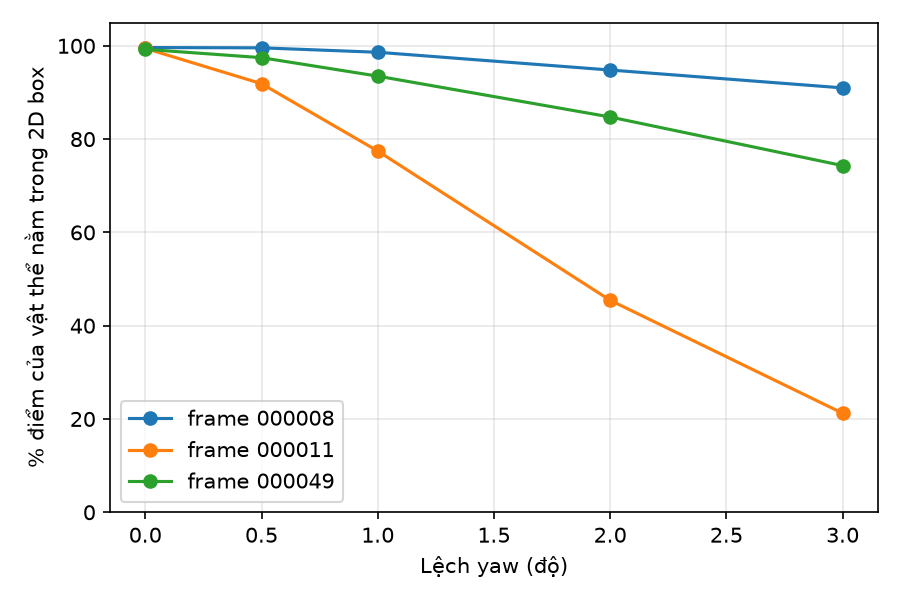
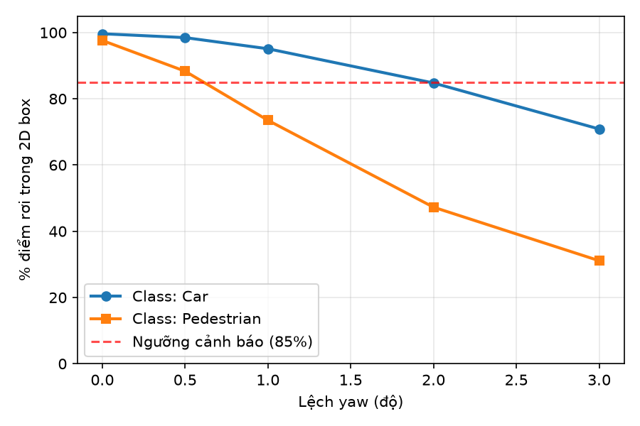

# Báo cáo Day 6: Độ nhạy của projection với lệch yaw

- **Họ tên:** Trần Đình Duy
- **MSSV:** 2A202602631
- **Lớp:** AI20K-T4
- **Link repo:** https://github.com/Duytd26/TranDinhDuy-2A202602631-Track4-Day21
- **Topic:** A — LiDAR-camera projection QA
- **Dataset:** data/kitti_mini
- **Các frame đã dùng:** 000008, 000011, 000049

> Hãy viết ngắn: mỗi mục từ 3 đến 8 dòng, ưu tiên số liệu và hình ảnh.

## 1. Claim

Lệch góc xoay yaw extrinsic LiDAR-camera từ 1.0° trở lên làm tỉ lệ điểm LiDAR của người đi bộ rơi đúng vào 2D bounding box giảm hơn 20 điểm phần trăm (từ >99% xuống dưới 80%), trong khi với xe con chỉ giảm dưới 5 điểm phần trăm; và khi lệch 2.0° tỉ lệ của người đi bộ giảm hơn 50%, đủ để làm sai lệch hoàn toàn tính năng sensor fusion. Hiện tượng này có thể phát hiện được bằng tỉ lệ điểm rơi trong 2D box với ngưỡng cảnh báo 85%.

## 2. Evidence

Kết quả benchmark quét góc lệch yaw từ 0.0° đến 3.0° trên 3 frame tiêu biểu của KITTI (`results/yaw_perturb_sweep.csv`):

| Mức lệch yaw (độ) | Frame 000008 (đông xe) | Frame 000011 (nhiều người) | Frame 000049 (bị che khuất) | Trung bình Car | Trung bình Pedestrian |
|---|---|---|---|---|---|
| **0.0° (chuẩn)** | 99.63% | 99.45% | 99.25% | 99.64% | 97.60% |
| **0.5°** | 99.57% | 91.88% | 97.46% | 98.47% | 88.32% |
| **1.0°** | 98.62% | 77.44% | 93.50% | 95.10% | 73.50% |
| **2.0°** | 94.81% | 45.44% | 84.74% | 84.76% | 47.25% |
| **3.0°** | 90.98% | 21.23% | 74.32% | 70.87% | 31.10% |




**Nhận xét xu hướng:**
- **Độ nhạy lệch theo kích thước đối tượng:** Lệch yaw ảnh hưởng nặng nhất tới đối tượng hẹp (người đi bộ ở frame 000011): ở 1.0°, tỉ lệ điểm trúng rơi mạnh từ 99.5% xuống 77.4% (tụt 22.01%), và ở 2.0° chỉ còn 45.44% (giảm hơn 54%). Ngược lại, xe con ở frame 000008 chỉ giảm nhẹ xuống 98.62% ở 1.0° và 94.81% ở 2.0° do bề ngang xe trên ảnh rộng gấp nhiều lần độ trượt $\approx 12.6$ pixel.
- **Ngưỡng phát hiện lỗi calibration:** Đặt ngưỡng `hit_ratio` ở mức **85%** cho phép phát hiện sớm độ lệch yaw từ 1.0° đối với người đi bộ và từ 2.0° đối với toàn bộ các đối tượng thông thường, trước khi hệ thống fusion bị lỗi nghiêm trọng.
- **Tính tái lập:** Thí nghiệm cố định cấu hình, chạy lại cho kết quả giống hệt 100% (`filecmp.cmp` ra `GIỐNG HỆT`).

## 3. Failure case

Nêu khi nào hệ thống hoặc phương pháp fail, vì sao fail, và liên hệ tới lớp nào trong 6 lớp debug: I/O, Geometry, Time, Preprocess, Model, Metric.


[ĐIỀN]

## 4. Khuyến nghị nếu triển khai thật

Use-case cụ thể (ADAS / robot / drone), trade-off và bước tiếp theo.

[ĐIỀN]

## 5. Cách chạy lại

Các lệnh tái tạo lại toàn bộ kết quả từ repo sạch:

```bash
# 1. Tự kiểm tra 2 hàm projection:
python -m src.test_projection

# 2. Tạo demo overlay ở 3 khoảng cách (gần: 000019, vừa: 000011, xa: 000004):
python -m starter.projection --data-root data/kitti_mini --frame 000019
python -m starter.projection --data-root data/kitti_mini --frame 000011
python -m starter.projection --data-root data/kitti_mini --frame 000004

# 3. Chạy thí nghiệm chính (benchmark sweep yaw):
python -m src.exp_yaw_sweep --data-root data/kitti_mini --frames 000008 000011 000049

# 4. Vẽ biểu đồ benchmark:
python -m src.plot_yaw_sweep

# 5. Chạy phân tích mở rộng theo từng Class (Car vs Pedestrian):
python -m src.exp_yaw_by_class --data-root data/kitti_mini --frames 000008 000011 000049
```

## 6. Khai báo sử dụng AI

| Công cụ | Dùng cho việc gì | Bạn đã kiểm chứng thế nào |
|---|---|---|
| AI Assistant | Hỗ trợ giải thích lý thuyết toán học phép chiếu, rà soát công thức ma trận | Tự kiểm chứng bằng hàm test số học `src/test_projection.py` khớp kỳ vọng 100% |
| Codelab Starter | Khung code khởi đầu đọc dữ liệu và gợi ý hàm thí nghiệm | Tự mở rộng phân tích class `src/exp_yaw_by_class.py`, kiểm tra tái lập bằng `filecmp` |
